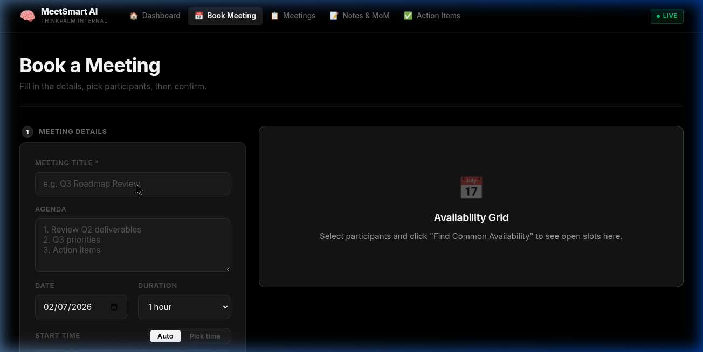
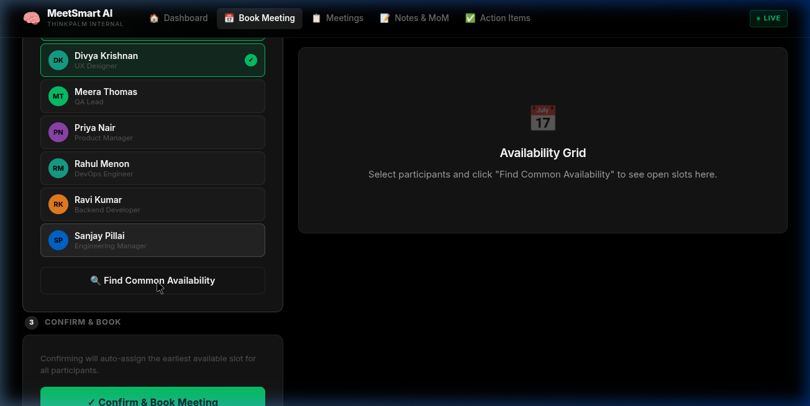
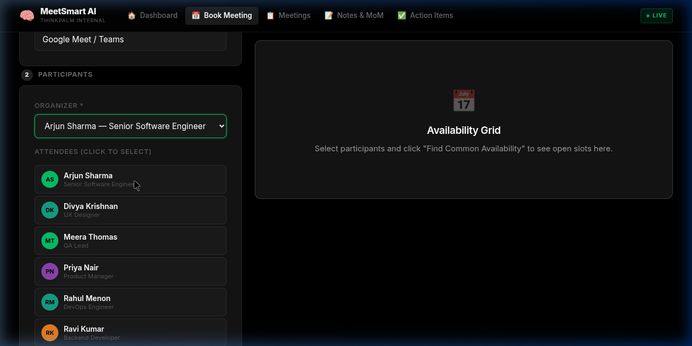

# 🧠 MeetSmart AI

> **Internal AI-Powered Meeting Platform for ThinkPalm Teams**  
> From slot discovery to post-meeting artefact delivery — powered by six specialised AI agents.

[](https://python.org)
[](https://fastapi.tiangolo.com)
[](https://react.dev)
[](https://sqlite.org)
[](tests/)
[](requirements.txt)

---

## 📋 Problem Statement

ThinkPalm teams spend significant overhead on meeting coordination: finding common slots across participants, drafting agenda emails, writing notes, creating action-item trackers, and sending follow-up reminders. These activities are fragmented across multiple paid tools (Calendly, Doodle, Otter.ai, Notion), leading to missed action items, poor documentation, and scheduling conflicts.

**MeetSmart AI** eliminates this entirely with a self-hosted, AI-powered platform that handles the complete meeting lifecycle — from availability check to Minutes of Meeting delivery — using six specialised agents. **Total cost: $0.**

---

## 👥 Team Members & Individual Contributions

| Name | Role | Contribution |
|---|---|---|
| **Sachin Sooraj** | Full-Stack Developer | End-to-end system design; all 6 AI agents; FastAPI backend & REST API; SQLAlchemy/SQLite schema; React UI (5 pages + Uber design system); booking flow & availability grid; Pytest suite (21 tests); `run.sh` automation; environment config & documentation |

---

## 🏗️ Architecture

```
User (React UI — localhost:5173)
      │
      ▼
FastAPI Backend (localhost:8000)
      │
      ├──▶ [1] Availability Agent ──▶ SQLite (slots table)
      │         Reads/writes free time slots per employee
      │
      ├──▶ [2] Booking Agent ──▶ SQLite (meetings table)
      │         Finds earliest common slot, creates meeting record
      │         └──▶ [3] Invite Agent (background task)
      │                    Generates RFC-5545 .ics file + sends HTML email
      │
      ├──▶ [4] Notes Agent ──▶ Claude Sonnet 4.6 / Rule-based parser
      │         Transcript → structured summary, decisions, action items
      │         └──▶ [5] MoM Agent
      │                    Generates Word .docx, emails to all participants
      │
      └──▶ [6] Reminder Agent (APScheduler)
                 Sends pre-meeting (24h, 1h) and post-meeting emails
```

See [`docs/architecture.png`](docs/architecture.png) for the full diagram and [`docs/writeup.md`](docs/writeup.md) for the 1-page platform write-up.

---

## ⚙️ Tech Stack

| Component | Technology | Version | Cost |
|---|---|---|---|
| Frontend | React + Vite | 18 / 5.4 | Free / OSS |
| Backend API | FastAPI | 0.111.0 | Free / OSS |
| Database | SQLite (SQLAlchemy) | 2.0.30 | Free / OSS |
| LLM | Claude Sonnet 4.6 | 0.7.2 (free tier) | Free |
| Calendar Invites | `icalendar` | 5.0.13 | Free / OSS |
| Word Documents | `python-docx` | 1.1.2 | Free / OSS |
| Task Scheduling | APScheduler | 3.10.4 | Free / OSS |
| Email | Python SMTP (Gmail / mock) | stdlib | Free |
| Testing | pytest | 8.2.0 | Free / OSS |
| CSS | Vanilla CSS (no Tailwind) | — | Free |

**Total cost: $0 — 100% free and open-source.**

---

## 🚀 How to Run Locally

### Prerequisites

- Python 3.11+
- Node.js 18+ and npm

### Step 1 — Clone and enter the project

```bash
git clone https://github.com/your-org/meetsmart-ai.git
cd meetsmart-ai
```

### Step 2 — Install Python dependencies

```bash
pip install -r requirements.txt
```

### Step 3 — Install frontend dependencies

```bash
cd frontend && npm install && cd ..
```

### Step 4 — Configure environment

```bash
cp .env.example .env
# Edit .env if needed:
#   GEMINI_API_KEY=   (optional — get free at https://ai.google.dev)
#   SMTP_MODE=mock    (default — emails print to terminal, no setup needed)
```

### Step 5 — Start everything with one command

```bash
chmod +x run.sh
./run.sh
```

This single command:
1. ✅ Initialises the SQLite database
2. ✅ Seeds 7 demo employees with 14 days of availability slots
3. ✅ Generates sample `.ics` and `.docx` files in `/samples`
4. ✅ Starts the FastAPI backend on `http://localhost:8000`
5. ✅ Starts the React frontend on `http://localhost:5173`

### Step 6 — Open the app

| URL | Description |
|---|---|
| **http://localhost:5173** | React UI — full application |
| **http://localhost:8000/docs** | Interactive Swagger API documentation |
| **http://localhost:8000/health** | Health check endpoint |

### Manual start (alternative)

```bash
# Terminal 1 — Backend
python3 src/db/seed.py
uvicorn src.api.main:app --reload --port 8000

# Terminal 2 — Frontend
cd frontend && npm run dev
```

### Troubleshooting

```bash
# If "no common slot found" error appears, refresh availability:
curl -X POST http://localhost:8000/api/availability/refresh-slots

# Add a new user:
curl -X POST http://localhost:8000/api/availability/employees \
  -H "Content-Type: application/json" \
  -d '{"name":"New Person","email":"new@thinkpalm.com","department":"Engineering","role":"Developer","timezone":"Asia/Kolkata"}'
```

---

## 🤖 Six AI Agents

| # | Agent | Trigger | What it does |
|---|---|---|---|
| 1 | **Availability Agent** | `POST /api/availability/overlap` | Queries SQLite for free slots across all selected employees, returns common time windows |
| 2 | **Booking Agent** | `POST /api/booking/book` | Selects optimal slot, creates meeting record, blocks all participant calendars |
| 3 | **Invite Agent** | Auto (background task) | Generates RFC-5545 `.ics` file, sends HTML email invite to every participant |
| 4 | **Notes Agent** | `POST /api/notes/process` | Takes meeting transcript → calls Gemini LLM → returns summary, decisions, action items with owners |
| 5 | **MoM Agent** | `POST /api/notes/generate-mom/{id}` | Creates formatted Word `.docx` document, saves to `/outputs/`, emails to all participants |
| 6 | **Reminder Agent** | Auto (APScheduler) | Schedules emails: 24h before, 1h before meeting, 24h after (action item follow-up) |

---

## 📂 Folder Structure

```
main-project/
├── src/                        # All backend source code
│   ├── agents/                 # Six AI agent modules
│   │   ├── availability_agent.py
│   │   ├── booking_agent.py
│   │   ├── invite_agent.py
│   │   ├── notes_agent.py
│   │   ├── mom_agent.py
│   │   └── reminder_agent.py
│   ├── api/                    # FastAPI application
│   │   ├── main.py             # App entry point, CORS, routers
│   │   ├── models.py           # Pydantic request/response schemas
│   │   └── routes/             # API route handlers
│   ├── db/                     # Database layer
│   │   ├── models.py           # SQLAlchemy ORM models
│   │   ├── database.py         # Engine + session factory
│   │   └── seed.py             # Employee + slot seeder
│   ├── services/               # External integrations
│   │   ├── email_service.py    # SMTP + HTML email templates
│   │   ├── ics_service.py      # iCalendar .ics generator
│   │   ├── docx_service.py     # Word document generator
│   │   └── gemini_service.py   # Google Gemini LLM client
│   └── utils/
│       └── config.py           # Pydantic Settings / .env loader
├── frontend/                   # React + Vite frontend
│   └── src/
│       └── components/         # BookingPage, MeetingList, NotesUpload,
│                               # ActionItemTracker, Dashboard, AvailabilityGrid
├── docs/                       # Documentation
│   ├── architecture.png        # Multi-agent architecture diagram
│   ├── architecture.py         # Diagram generation script
│   ├── writeup.md              # 1-page platform write-up
│   └── screenshots/            # App screenshots
├── tests/                      # Pytest test suite (21 tests)
│   ├── test_availability_agent.py
│   ├── test_booking_agent.py
│   └── test_notes_agent.py
├── samples/                    # Pre-generated sample artefacts
│   ├── sample_meeting.ics
│   ├── sample_mom.docx
│   └── sample_action_items.json
├── outputs/                    # Runtime: MoM .docx files saved here
├── requirements.txt            # Python dependencies with pinned versions
├── .env.example                # Environment variable template
├── run.sh                      # One-command startup script
└── README.md
```

---

## 🧪 Running Tests

```bash
pytest tests/ -v
```

**Expected output (21/21 passing):**

```
tests/test_availability_agent.py::TestAvailabilityAgent::test_list_employees                   PASSED
tests/test_availability_agent.py::TestAvailabilityAgent::test_get_employee_found               PASSED
tests/test_availability_agent.py::TestAvailabilityAgent::test_get_employee_not_found           PASSED
tests/test_availability_agent.py::TestAvailabilityAgent::test_get_slots_only_available         PASSED
tests/test_availability_agent.py::TestAvailabilityAgent::test_get_overlap_no_common_slots      PASSED
tests/test_availability_agent.py::TestAvailabilityAgent::test_get_overlap_empty_employee_ids   PASSED
tests/test_booking_agent.py::TestBookingAgent::test_book_meeting_success                       PASSED
tests/test_booking_agent.py::TestBookingAgent::test_book_meeting_no_slot                       PASSED
tests/test_booking_agent.py::TestBookingAgent::test_cancel_meeting_success                     PASSED
tests/test_booking_agent.py::TestBookingAgent::test_cancel_meeting_not_found                   PASSED
tests/test_booking_agent.py::TestBookingAgent::test_list_meetings_empty                       PASSED
tests/test_booking_agent.py::TestBookingAgent::test_list_meetings_with_data                   PASSED
tests/test_booking_agent.py::TestBookingAgent::test_mark_completed                            PASSED
tests/test_notes_agent.py::TestRuleBasedNotes::test_extract_action_items                      PASSED
tests/test_notes_agent.py::TestRuleBasedNotes::test_extract_decisions                        PASSED
tests/test_notes_agent.py::TestRuleBasedNotes::test_extract_topics                           PASSED
tests/test_notes_agent.py::TestRuleBasedNotes::test_generate_summary                         PASSED
tests/test_notes_agent.py::TestRuleBasedNotes::test_result_structure                         PASSED
tests/test_notes_agent.py::TestRuleBasedNotes::test_empty_transcript                         PASSED
tests/test_notes_agent.py::TestRuleBasedNotes::test_priority_detection                       PASSED
tests/test_notes_agent.py::TestRuleBasedNotes::test_deadline_extraction                      PASSED

===================== 21 passed in 0.49s =====================
```

---

## 🖼️ Screenshots

### Dashboard

*Home dashboard showing team roster, agent status, and upcoming meetings*

### Book a Meeting

*Step-by-step booking flow with date picker, time selector, and participant selection*

### Participant Selection & Availability Grid

*Click attendees → Find Common Availability → pick a green slot or auto-assign*

### Participants Selected

*Selected attendees shown with green checkmarks; Step 3 confirm button appears*

---

## 🎥 Demo Video

> **Loom:** *https://www.loom.com/share/8c9b9d7863e5496ab24c3fba947f3931*
>
> Suggested demo flow (15 min):
> 1. Dashboard tour (2 min)
> 2. Book a meeting end-to-end (4 min)
> 3. Process meeting notes with AI (3 min)
> 4. Generate and view Minutes of Meeting (2 min)
> 5. Action item tracker + status update (2 min)
> 6. Show API docs at /docs (2 min)

---

## 📧 Email Configuration

### Mock Mode (default — demo-safe, no setup)
```env
SMTP_MODE=mock
```
Emails print to the terminal with full HTML content. Ideal for demos.

### Gmail Mode (sends real emails to participants)
```env
SMTP_MODE=gmail
GMAIL_ADDRESS=your-email@gmail.com
GMAIL_APP_PASSWORD=xxxx-xxxx-xxxx-xxxx   # 16-char App Password
```

**To get a Gmail App Password:**
1. Go to [myaccount.google.com/apppasswords](https://myaccount.google.com/apppasswords)
2. Select app: **Mail** → device: **Other** → name it `MeetSmart`
3. Copy the 16-character password into `.env`

---

## 📦 Sample Artefacts

| File | Description |
|---|---|
| `samples/sample_meeting.ics` | iCalendar invite — importable into Google Calendar / Outlook |
| `samples/sample_mom.docx` | Auto-generated Minutes of Meeting Word document |
| `samples/sample_action_items.json` | Structured action items extracted from a transcript |
| `docs/architecture.png` | Multi-agent system architecture diagram |

---

## 💡 What Makes This Different

| Feature | Calendly | Google Meet | MeetSmart AI |
|---|---|---|---|
| Multi-participant availability | ✅ (paid $10/mo) | ❌ | ✅ **Free** |
| AI meeting notes & summary | ❌ | ❌ | ✅ Gemini LLM |
| Auto MoM Word document | ❌ | ❌ | ✅ |
| Action item tracking with owners | ❌ | ❌ | ✅ |
| Pre + post meeting reminders | ✅ (paid) | ❌ | ✅ Free |
| `.ics` calendar invite | ✅ | ✅ | ✅ |
| Self-hosted / on-premise | ❌ | ❌ | ✅ |
| All data stays internal | ❌ (cloud) | ❌ (cloud) | ✅ SQLite local |
| Full REST API | ❌ | partial | ✅ Swagger docs |

---

## 📄 License

MIT License — open source, free to use and modify.

---

*Built with ❤️ by the ThinkPalm Engineering team · MeetSmart AI v1.0.0*
